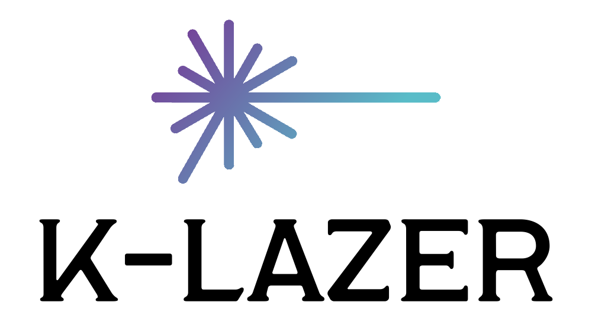

 

  

  

    An sleek and simple screen overlay application made to facilitate teaching and learning
     
     
    <a href="#content"><strong>Find Out More »</strong></a>
     
     
  

## Introduction

K-Lazer is a project aiming to provide an interface from which teachers can interact with and engage their students. The project is designed to facilitate 
teaching with the use of a computer or interactive whiteboard, using a simple, sleek, and highly customizable overlay, made using the [Unity Game Engine](https://unity.com/).  

K-Lazer comes with many features to help teachers in their lessons, all designed to be easy to access, so that they can focus on their class. 
These include a customizable laser pointer, annotation support, and screen shot / recording capabilties; all just a click away.

(<a href="#top">back to top</a>)

## Usage

(<a href="#top">back to top</a>)

## Releases

(<a href="#top">back to top</a>)

## Announcements

(<a href="#top">back to top</a>)

## Bug Reporting

(<a href="#top">back to top</a>)

## Feature Requests

(<a href="#top">back to top</a>)

## Roadmap

To view the project roadmap, please go to [This Project Board](https://github.com/OneBigUnit/Laser-Pointer-App/projects/2).  
You can also visit the [New Features & Ideas]() Discussion Thread to see other unofficial features that may make it into future releases.

(<a href="#top">back to top</a>)

## Contact

(<a href="#top">back to top</a>)

## License

Distributed under the MIT License. See [LICENSE.txt](https://github.com/OneBigUnit/K-Lazer/blob/Source/LICENSE) for more information.

(<a href="#top">back to top</a>)

